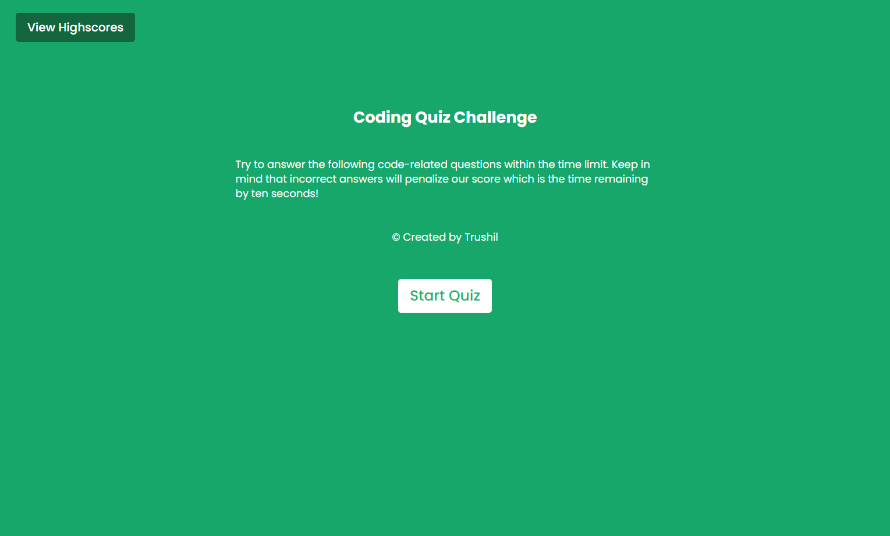
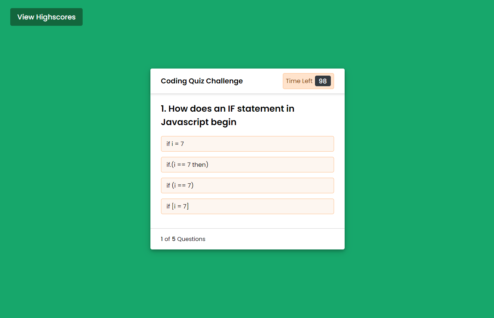

# Code-Quiz

## Description

A timed multiple choice quiz on Javascript fundamentals. Scores can be saved at the end of the quiz to a highscore table.

The user also has the option to clear the highscores off the highscore table if they wish.

## Link

The link to the deployed application:

Code Quiz: https://trushilbudhia.github.io/Code-Quiz/

## Assets

The following images show the web application's appearance:

> **Note**: This layout is responsive.
