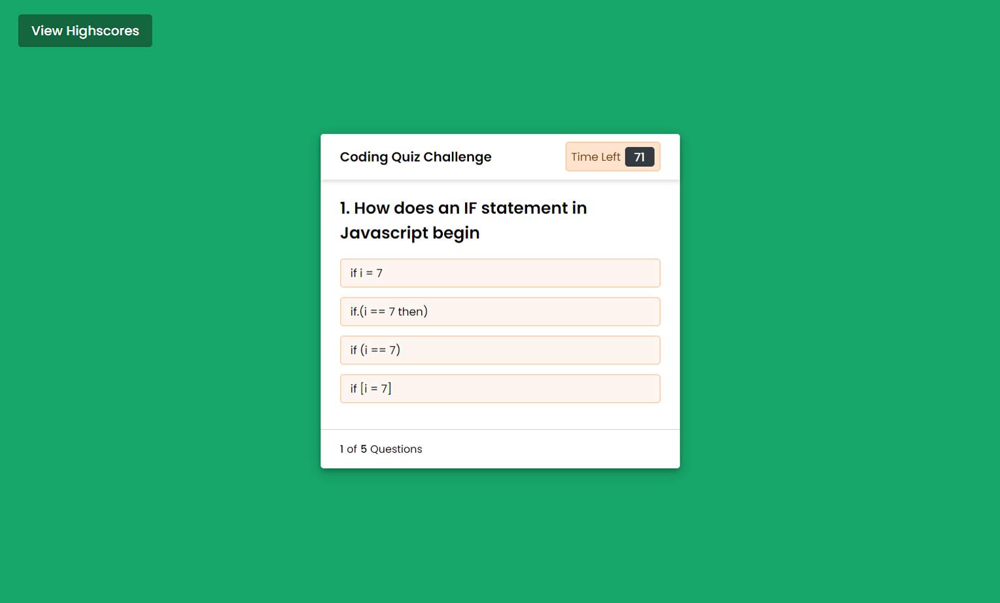

# Code Quiz

## 📖Table of Contents
1. [Description](#description)
2. [Link](#Link)
3. [Screenshots](#Screenshots)
4. [Technologies](#Technologies)
5. [Contributing](#Contributing)
6. [Author](#Author)
7. [License](#License)

## Description
A timed multiple choice quiz on Javascript fundamentals. Scores can be saved at the end of the quiz to a highscore table.

The user also has the option to clear the highscores off the highscore table if they wish.

## Link
The link to the deployed application:

Code Quiz: https://trushilbudhia.github.io/Code-Quiz/

## Screenshots
The following images show the web application's appearance:

> **Note**: This layout is responsive.

## Technologies
- JavaScript
- HTML
- CSS
- Font Awesome (icons)

## Contributing
Contributions, issues and feature requests are welcome.

Feel free to check [issues page](https://github.com/TrushilBudhia/Code-Quiz/issues) if you want to contribute.

## Author
👤Trushil Budhia
- Github: [@Trushil](https://github.com/TrushilBudhia)
- Email: trushil.budhia@gmail.com

## License
Copyright © 2021 [Trushil](https://github.com/TrushilBudhia)

This project is [MIT](./LICENSE) licensed
